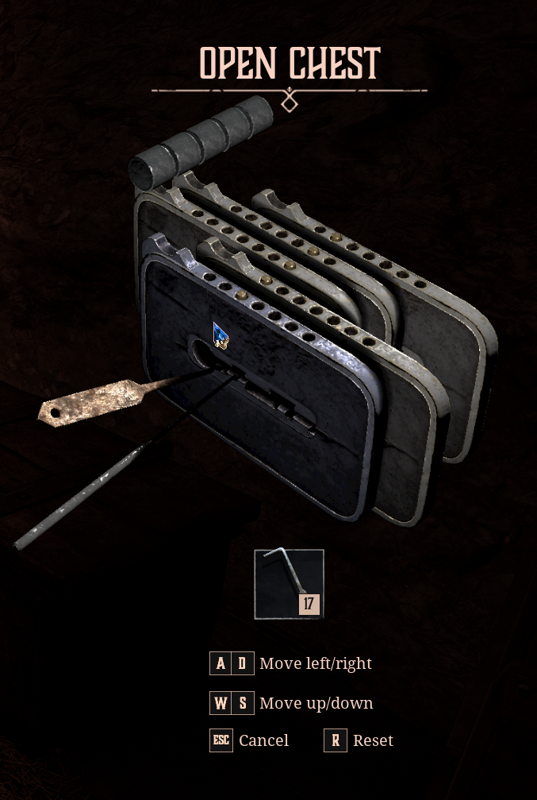
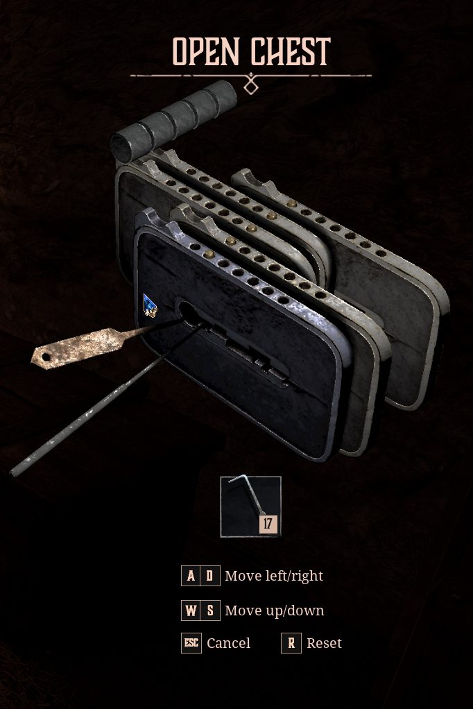

# Gothic Remake Picklocking Solver

A small Python solver for Gothic Remake lock puzzles. The script reads a lock configuration from input files, searches the allowed move space, and prints a sequence of keyboard commands (`W`, `S`, `D`, `A`) that should open the lock.

## What it does

- Reads lock setup from three text files: `initial.txt`, `moves.txt`, and `max_depth.txt`
- Uses a search algorithm to explore valid plate moves
- Prints a candidate keypress sequence to open the lock

## Requirements

- Python 3
- `picklocking.py` and the input files must be in the same folder

## Usage

1. Clone the repository:
   ```powershell
   git clone https://github.com/Bartanakin/Gothic-Remake-Picklocking.git
   cd "Picklocking Gothic Remake"
   ```
2. Run the solver:
   ```powershell
   python picklocking.py
   ```

If the solver does not find a solution, increase the value in `max_depth.txt` and try again.

## Input files

The solver expects three files next to `picklocking.py`.

### `initial.txt`

Specifies the starting plate positions.

- The file contains one line with numbers from `1` to `7`.
- Each number represents the initial position of a plate in the.
- Plates are ordered from left-bottom to right-top.
- `1` means the plate is farthest toward left-bottom.
- `7` means the plate is farthest toward right-top.

If the lock has `n` plates, this line should contain exactly `n` numbers.

Look at the example below:



The corresponding content of `initial.txt` is:
```
57126
```

### `moves.txt`

Describes how plates respond when the picklock moves left or right.

- Exactly `n` lines, one line per plate
- Each line contains exactly `n` characters
- Valid characters:
  - `F` = Forward
  - `R` = Reversed
  - `N` = Neutral

Each line describes how the plates behave when the player presses `D` or `A`.

There are always `2 * n` possible moves in the lock system, and some moves may break the picklock (the algorithm will never select them, don't worry).

Look at the example below:



and compare it with the previous example. Plate number `1` was moved exactly once to the right (the player clicked `D`). Plates `2` and `3` did not budge, plate `4` slid the opposite direction to plate `1`, whereas plate `5` slid the same direction.
Therefore the first line of `moves.txt` is:
```
FNNRF
```

### `max_depth.txt`

Defines the maximum number of plate slides the solver is allowed to explore.

- One integer value only
- Prevents the search from running indefinitely
- Increase this value if no solution is found

## Example workflow

1. Create `initial.txt` with the starting plate positions
2. Create `moves.txt` with the plate interaction rules
3. Set a search depth in `max_depth.txt`
4. Run `python picklocking.py`
5. Read the output sequence of `W`, `S`, `D`, and `A`

## Notes

- The solver may skip moves that would break the picklock
- If the configuration is invalid, the script may fail or return no solution
- Keep the input files next to `picklocking.py`
